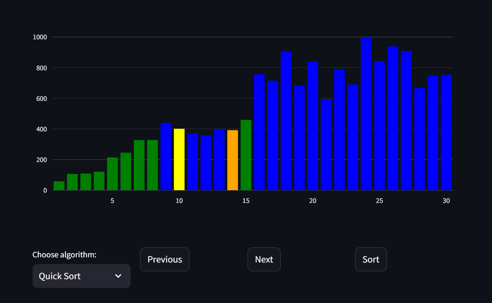

# Sorting Visualizer
A simple program to help visualize sorting algorithms

## Features
- Shows various sorting algorithms in action as bar graph
- Implementation of bubble sort, selection sort, insertion sort, quick sort, merge sort and heap sort
- Color coding bars for better visualization
- Buttons to move between previous and next steps
- Button to automatically sort the entire array

## Usage
### Requirements
```bash
pip install streamlit
pip install plotly
```

### Run
```
streamlit run app.py
```

### Example
